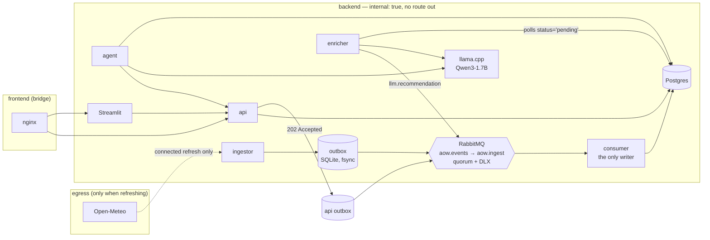

# act-on-weather

Weather for five cities, turned into activity recommendations by a **local**
open-weights model, with every collected record travelling through a queue into
Postgres — and the whole thing running with **no internet at all** once it has
been staged.

For example, ask it about the weather in Rome on **2026-09-24**. Its answer
includes the weather source and the time the forecast was collected. The
bundled forecast was collected on **2026-09-23** and covers **2026-09-23 to
2026-10-08**; it does not update itself during a normal run. Ask about a date
outside that window and the system says it has no forecast instead of guessing.

---

## Quick start

**The only thing you need on the host is Docker** — Docker Desktop on Windows
or macOS, Docker Engine with the Compose plugin on Linux. No `make`, no `curl`,
no `python`, nothing to install beyond that. Give Docker at least **8 GB of
memory** and a few GB of free disk, and start it before you begin.

Everything below is one recipe. The commands are character-identical on
Windows, macOS and Linux except the single line that creates `.env`. Run them
in a terminal opened in this project's folder.

### 1. Settings

On Linux and macOS:

```sh
cp .env.example .env
```

On Windows, in PowerShell:

```powershell
Copy-Item .env.example .env
```

Then open `.env` in any editor, replace **every** `change-me` with a different
password, and save. If `.env` already exists, skip the copy and keep it. The
file is gitignored; keep it private.

### 2. Stage it — once, with internet

```sh
docker compose pull postgres rabbitmq llm edge
docker compose -f compose.tools.yml run --rm stage
docker compose build
docker compose -f compose.tools.yml build demos
```

| | |
|---|---|
| `pull` | the four upstream images (~2.2 GB), every one pinned by digest |
| `run --rm stage` | downloads the model (~1.2 GB) into `models/` and checks it against **`models.lock`** — the only place in this repository where its checksum is written. A model that is already staged is re-verified rather than re-fetched, so running this twice is safe and quick. |
| `build` | the five Python services and the UI |
| `build demos` | the proof runner, built now, while there is still a network, because the proofs have to work after it goes away |

To stage from an internal mirror rather than the public internet, set
`MODEL_BASE_URL` in `.env`. The checksum check is identical either way.

### 3. Run it — no internet needed

```sh
docker compose up -d
```

### Open and stop the app

Open **<http://localhost:8080>**. The API documentation is at
<http://localhost:8000/docs>. The first start takes several minutes while the
model loads and the saved data enters the database. Check progress with
`docker compose ps`; an exited `migrate` container with code 0 is normal. If
the page does not load after a few minutes, run `docker compose logs --tail 50`
to see the startup messages.

Stop it with `docker compose down`, and start it again later with
`docker compose up -d`. Both keep the database and queue data. Do not use
`docker compose down -v` unless you mean to delete those volumes.

### Shorthand

`make` is a convenience for hosts that have it, and nothing requires it. Each
target is the Docker command next to it, and the Docker command is what works
everywhere:

| shorthand | what it actually runs |
|---|---|
| `make stage` | the four staging commands above |
| `make up` / `make down` | `docker compose up -d` / `docker compose down` |
| `make up-demo` | `docker compose -f compose.yml -f compose.demo.yml up -d` |
| `make test` | `docker build -q -f tests/Dockerfile -t aow/tests:dev .` then `docker run --rm aow/tests:dev` |
| `make offline` | `docker compose -f compose.tools.yml run --rm demos offline` |
| `make questions` | `… run --rm demos questions` |
| `make no-data-loss` | `… run --rm demos no-data-loss` |
| `make update` | `… run --rm demos update` |
| `make reenrich` | `… run --rm demos reenrich` |
| `make demo` | `… run --rm demos all` |
| `make refresh` | `docker compose -f compose.yml -f compose.connected.yml up -d ingestor` then `docker compose exec ingestor python -m services.ingestor.refresh` |
| `make snapshot` | `docker compose -f compose.yml -f compose.connected.yml run --rm --no-deps ingestor python -m services.ingestor.fetch_content` |

Both forms run the same scripts from this same working tree — `demos/*.sh` is
one implementation, and the container is only a shell to run it in. The stack
must already be up; the proofs reach it over the internal network, through the
same `edge` proxy the browser uses.

**The `demos` container mounts the Docker socket**, which is root-equivalent
access to the host's Docker daemon. That is deliberate and it is the point: the
drills stop the consumer, stop the broker and restart the model server, so
driving Docker *is* the proof. It is why the proof runner is a `docker compose
run` you type on purpose and never part of `up`, and why it lives in
`compose.tools.yml` rather than in `compose.yml`. Nothing in the running stack
has the socket. If you would rather not grant it, run the same scripts directly
on a host with bash: `bash demos/01_offline.sh`.

### Demo mode

A default run stores the **seven hand-verified events**, all of them in London,
and answers "none on record" for the other four cities. To see the trip planner
and the agent working with events in all five cities, switch to **demo mode**:

```sh
docker compose -f compose.yml -f compose.demo.yml up -d
```

Demo mode adds 45 **generated sample events**, labelled wherever they appear.
The UI also shows a demo banner. Run `docker compose up -d` to return to
verified events only; the generated events are removed from the database. The
section
[Events: verified, and generated](#events-verified-and-generated) says exactly
what they are and why they exist.

The saved data is included in `data/snapshot/`. Once staging has downloaded the
images and the model, a normal run needs no internet. A fresh clone alone is
**not** ready for offline use, because the images and the model are not in Git.

---

## What it does

| | |
|---|---|
| **Collects** | 16-day daily forecasts for Rome, London, Lisbon, Tel Aviv and Reykjavík; 282 places, 81 background articles, and **7 verified events** (+ 45 labelled samples in demo mode) |
| **Decides** | a deterministic suitability score per (city, day, activity) across **18 activities**, from rules in `data/activities.yml` |
| **Words** | a local Qwen3-1.7B writes one or two sentences about each score |
| **Answers** | an agent resolves the question in code and answers from stored rows only |
| **Plans** | a day-by-day itinerary assembled from rows that actually exist |
| **Updates** | corrections and refreshes, both travelling through the queue |

### Tabs

Seven, across the top of the page. Each one draws under the coverage strip in the
header, which carries the as-of stamp and the forecast window.

* **Forecast** — temperature and rainfall per city, with the stored rows behind it.
* **Suitability** — a city × day × activity heatmap over all 18 activities, plus
  a box to ask about *any* activity you type, not just the ones with rules.
* **Trip planner** — a day-by-day plan with three suggestions per day, weighted
  by the interests and activities you pick. See
  [Choosing a day's activity](#choosing-a-days-activity).
* **Places map** — filter stored places by city, category or name; inspect their
  coordinates and source links, and highlight stops from the current itinerary.
  Streets, water and parks are staged with the coastline and bundled locally,
  so pan and zoom work without map tiles.
* **Ask the agent** — chat, with a panel showing exactly which rows the answer used.
* **Update data** — all three M12 update paths in one place: connected refresh,
  correcting a stored record, and re-wording with the local model.
* **Data coverage** — what is held, per record type and per city, which rows are
  labelled samples, and how far the wording queue has got.

The UI is Streamlit. Its own toolbar is switched off in
`services/ui/.streamlit/config.toml` (`toolbarMode = "minimal"`): that toolbar's
"Deploy" button offers to publish the app to Streamlit Community Cloud, which is
not ours, does nothing useful here, and in an air-gapped demo reads as an offer
to deploy this stack.

The styling (`services/ui/theme.py`) is one inline stylesheet — no CSS file to
serve, no webfont, no icon set, no CDN, because the runtime rule is zero network
calls. Icons are unicode glyphs from `data/activities.yml`. If the stylesheet
failed to apply, every number and timestamp would still be on the page.

### Choosing a day's activity

The rule engine gives every (city, day, activity) a score, and that score is the
source of truth everywhere — the heatmap, the API and the agent all report it
unmodified. The trip planner applies two adjustments **on top of it**, purely to
order a day's suggestions (`services/agent/planning.py`):

* an activity matching a stated interest gains `INTEREST_BONUS` (15)
* an activity already used on an earlier day loses `REPEAT_PENALTY` (18) per use

Both are small enough that the weather still decides: ticking "museums" does not
beat a perfect beach day. The repeat penalty exists because without it a warm,
dry city returns the same answer every day — a week in Tel Aviv in September
came back as "a day at the beach" seven times, since it scores 100 on all seven.
The **Vary the plan across days** toggle turns the penalty off, so the raw
ranking can be seen side by side. Both modes are deterministic: the same request
rebuilds the same plan.

### Activities that are not scored everywhere

Five activities — surfing, swimming, the beach, fishing and a boat ride — carry
`requires_coast` in `data/activities.yml` and are only scored for cities marked
`coastal` in `data/cities.yml`. London is not, so it has 13 activities scored
rather than 18, and **no surfing row at all**. A score for surf derived from an
inland forecast is a number the system cannot stand behind.

The agent enforces the same boundary. It matches the activity a question names
against the `keywords` in `data/activities.yml` and renders the stored daily
scores directly. An unscored activity is reported as having no score on record;
for coastal activities in inland cities, it also says why. This avoids a
misleading overall verdict from the small model: in a live seven-day running
question, it called a week with seven `fair` scores a “good week.” Open-ended
questions still use the local model to phrase the retrieved data.

### What gets worded, and what does not

Scoring 18 activities for 5 cities over 16 days is ~1,300 rows and costs
microseconds. Asking a CPU-bound 1.7B model to write a sentence about each of
them is ~1,300 generations through a slot the agent also shares — hours.

So the consumer ranks each city-day and marks only the top `ENRICH_TOP_N`
(default 6) as `pending`; the rest are stored `deferred`. A deferred row is
scored, charted and answerable — it was simply never queued for prose. Asking
about that activity by name promotes it back to `pending`, and so does the
**Re-word with the model** control on the Update tab. The UI says which is
which rather than showing a blank explanation.

The `llm` service runs with `--parallel 2` for the same reason: with one slot an
interactive question queued behind an enrichment batch and timed out as though
the model were down.

---

## Architecture



Eleven containers. `postgres`, `rabbitmq`, `migrate` (one-shot), `llm`,
`ingestor`, `consumer`, `enricher`, `api`, `agent`, `ui`, `edge`.

### The data flow, exactly

1. The **ingestor** reads the committed snapshot (or fetches live, when
   attached to `egress`) and **fsyncs each record into a local SQLite outbox**
   on a named volume. *That write is the acceptance point.*
2. A publisher loop drains the outbox to RabbitMQ under **publisher confirms**
   with `mandatory=True`. A record is marked published only once the broker
   confirms it.
3. The **consumer** — the only role in the system holding write grants —
   validates the payload, then writes the business row **and** the
   `message_id` into `ingest_log` in **one transaction**, and acks only after
   that commits.
4. Storing weather also computes and stores the **rule-based score** for each
   activity, immediately, with `status='pending'` for the wording only.
5. The **enricher** polls pending rows, makes **one** grammar-constrained call
   to the local model, and publishes the result back into the exchange — so
   the recommendation reaches the database through the queue like everything
   else.
6. The **api** and the **agent** read as `aow_reader`, which holds `SELECT` and
   nothing else.

### Networks

| network | who is on it | why |
|---|---|---|
| `backend` | everything | `internal: true` — Docker itself gives it no gateway |
| `frontend` | `edge` only | Docker cannot publish a port from an internal network, so exactly one container straddles the boundary |
| `egress` | nobody, by default | `compose.connected.yml` attaches the ingestor for a refresh |

Only 8080 and 8000 are published. Not the database, not the broker, not the
management UI, not the model server.

---

## Delivery guarantees, and their boundary

**The guarantee.** From the moment a record is fsynced into a producer's outbox
on a named volume, it reaches one of exactly two terminal states:

* **stored** in Postgres, or
* **quarantined** in `aow.dlq`, visible and redrivable.

Consumer, broker and database outages *delay* a record. None of them lose it.

**How.** At-least-once delivery plus idempotent writes, which together give
effectively-once storage. The idempotency key is `message_id`, inserted into
`ingest_log` in the same transaction as the business write. Concretely:

| failure | what happens |
|---|---|
| consumer crashes **before** commit | nothing was written; the broker redelivers |
| consumer crashes **after** commit, **before** ack | the broker redelivers; `ingest_log`'s primary key rejects it; acked without a second write |
| database unreachable | the handler raises, the message is requeued, the consumer waits and reconnects |
| broker unreachable | publishing stops, **accepting does not**; records accumulate on the volume and replay |
| poison message | fails validation before any write, dead-letters to `aow.dlq`, does not block the queue |
| model down or slow | irrelevant to weather: the score is already stored, only the wording waits |

**What is *not* covered**, stated plainly: a destroyed volume, a full disk, and
data that was never accepted in the first place. Weather that was never fetched
can be re-fetched while connected — `make refresh`. There is no absolute
guarantee here and the code does not pretend otherwise.

**Proof, not assertion:**

```sh
docker compose -f compose.tools.yml run --rm demos no-data-loss
```

Four drills — consumer down, database down, broker down and poison message. Each follows a
**single accepted `message_id`** to its terminal state. Row counts are
deliberately not the assertion: a loss and a duplicate cancel out in a count.

---

## Technical choices, and what was rejected

| choice | why | rejected |
|---|---|---|
| **Open-Meteo** | no API key, so the air-gapped bundle has no secret to carry and no account to expire; the free tier includes the 16-day daily forecast that "this week" needs | **OpenWeather** — a key to manage, and its free tier splits the forecast horizon awkwardly |
| **RabbitMQ**, quorum queues | per-message ack after DB commit, a real DLX, and `x-delivery-limit` are exactly the primitives M11 needs, with the smallest operational surface | **Kafka/Redpanda** — offset-based, so per-message quarantine needs machinery; heavier for one node. **Redis Streams** — durability story is weaker and harder to defend |
| **Outbox before the broker** | publisher confirms alone cannot help if the broker is *unreachable*. The outbox is what makes "the broker is down" a delay rather than a loss | **confirms only** — leaves a window where an accepted record exists nowhere durable |
| **Deterministic score, model phrases it** | the verdict is reproducible, testable and defensible; a model outage degrades the wording, never the content | **LLM decides suitability** — unrepeatable, untestable, and it would put a 1.7B model on the critical path |
| **Router-first agent** | city, dates and coverage resolved in readable code; at most one model call to phrase retrieved rows. E1 answers in ~5 s | **model tool-calling** — 3–4 sequential generations on CPU (30–90 s), non-deterministic in front of a reviewer, and silent when it goes wrong |
| **Qwen3-1.7B Q4_K_M** | runs on CPU at ~1.2 s per call, Apache-2.0, 1.2 GB on disk, reliable under a JSON-schema grammar | a 3–4 B model — better prose, but 3–4× the latency on the reviewer's likely CPU-only machine |
| **Streamlit** | seven working tabs in the time a hand-written SPA would take to scaffold, and it bundles its own assets, so it works offline | a React SPA — more polish, but the brief weighs the pipeline more heavily |
| **Docker Compose** | one command, identical on Linux, macOS and Windows | Kubernetes — the production path, described below, not the demo path |

**Thinking mode is disabled on the model** (`enable_thinking: false`). Left on,
Qwen3 spends its whole token budget in `reasoning_content` and returns empty
content: measured 4.2 s and no answer, versus 1.2 s and a clean one.

---

## Offline operation, and its limits

```sh
docker compose -f compose.tools.yml run --rm demos offline
```

That script proves four things structurally — `aow_backend` really is
`internal`, no service can open an outbound connection, no hosted-model SDK or
endpoint exists anywhere in the source, and the model file is loaded from a
local bind mount — and then answers both of the brief's example questions plus
one deliberately out-of-range question.

**The real proof is behavioural: disable the host's network adapter and run it
again.** Everything above still passes.

**What offline cannot do**, and what happens instead:

| | |
|---|---|
| Fetch new weather | the coverage window stops moving; questions beyond it are **refused**, not guessed |
| Discover new places or events | the system says it has no record, rather than inventing one |
| Correct a stored record | **works offline** — it is a local write through the local queue |
| Re-word recommendations | **works offline** — the model is local |

When the snapshot goes stale, use the connected refresh below to re-fetch the
forecast and move the window forward. Until then, every answer and every chart
carries the as-of stamp that says how old it is.

---

## Data sources and licences

| data | source | licence | how |
|---|---|---|---|
| Weather | [Open-Meteo](https://open-meteo.com/) | CC BY 4.0 | fetched by `services/ingestor/fetch_content.py`, committed to `data/snapshot/weather.jsonl` |
| Places | **Wikidata** (default) or OpenStreetMap via Overpass | CC0 / ODbL © OpenStreetMap contributors | same script; every row keeps its own source URL |
| Map backdrop | OpenStreetMap via Overpass | ODbL © OpenStreetMap contributors | a 20 km extract per city — streets, water, coastline, parks — staged by `services/ingestor/fetch_basemap.py` into `data/map/<city>.basemap.geojson.gz`; 1.2 MB for all five |
| Map fallback shoreline | [Natural Earth 1:10m](https://www.naturalearthdata.com/downloads/10m-physical-vectors/) | public domain | bundled in `data/map/`; drawn only for a city with no staged extract. Source revision and checksum in `data/map/SOURCE.md` |
| Background | Wikipedia REST summaries | CC BY-SA 4.0 | same script; the city article plus one article per venue, resolved through its Wikidata sitelink |
| Events (verified) | venue listings | see each row's `source_url` | **hand-verified**, in `data/events.seed.jsonl`. Seven rows, all London. **The only events a default run stores.** |
| Events (generated samples) | generated from the places snapshot | n/a | `data/events.samples.jsonl`, every row `is_sample` and titled *Sample: …*. **Demo mode only** (`make up-demo`). |

**Why Wikidata and not OpenStreetMap for places.** OSM is the better source and
the code for it is still there (`--places-source osm`). It is not the default
because at staging time all four public Overpass mirrors were either refusing
connections or timing out — reproducibly, over an hour. Wikidata's SPARQL
endpoint answered in seconds. The trade is real and visible in the data:
Wikidata holds *notable* venues, so you get the Royal Academy of Music Museum
and Harrods, not every café on the street. Each row records which source it
came from, and the agent's footer names it, so nothing here is guesswork about
provenance.

**Why the background data is tied to the places.** The first attempt used
Wikipedia's geosearch, which is geographically correct and editorially useless:
within 6km of a city centre it returns administrative divisions ("Province of
Rome"), list articles, and — for Tel Aviv — a run of articles about shootings
and bombings. All true, none of it background for a trip planner, and a keyword
blocklist over article titles is a guess dressed up as a filter. Resolving the
Wikidata sitelink for each venue already in `places.jsonl` instead means every
landmark article is about somewhere the planner can actually send you, selected
by its Wikidata P31 class rather than by its distance from a point.

### Events: verified, and generated

**Nothing is passed off as real.** There is no free, licensable,
offline-stageable feed of concerts and fixtures for five cities, and fabricating
them was not an option. So there are two event files, kept apart at every layer:

* `data/events.seed.jsonl` — seven **real** listings, each checked by hand
  against its own source URL. `is_sample: false`. These are the only events the
  system claims are real, and they are all in London, because that is how far
  hand-verification got. **They are what a default run stores.**
* `data/events.samples.jsonl` — 45 rows generated by
  `services/ingestor/make_samples.py`. Every row is `is_sample: true`, its title
  begins with **"Sample:"**, and its `source` says in words that it is not a
  real listing. The venue in each row is real — it comes from the places
  snapshot — and its URL is that venue's own record, rendered as a **venue
  reference** rather than as the event's source, because there is no listing to
  point at. Generation is deterministic, so the committed file is reproducible.

They exist because with events in one city out of five, the planner and the
agent cannot be exercised anywhere else, and a reviewer cannot see how a sourced
event and a generated one are told apart — which is the interesting part.

**They are opt-in, and they do not linger.** Three separate places enforce that,
because "no fabricated row is in the database" is a claim worth more than one
check:

| | |
|---|---|
| **Snapshot** | two files, never merged: `data/snapshot/events.jsonl` (7) and `data/snapshot/events.samples.jsonl` (45) |
| **Ingestor** | replays the sample file only when `AOW_DEMO_EVENTS` is set, so a default run never even *accepts* a generated row |
| **Consumer** | the only role with write grants, so it is the last word: it drops a sample row that arrives while demo mode is off, whoever produced it, and on startup it deletes every `is_sample` row it finds |

The consumer's startup sweep is the part that matters: `AOW_DEMO_EVENTS`
describes the **database**, not just the run. Run `make up-demo`, look around,
then `make up` — the samples are gone, not merely hidden. Demo mode is also
visible while you are in it: the UI carries a banner naming the count and
saying which seven rows are real.

The loader drops any row in the sample file that does not admit to being a
sample, so the labelling is checked at the boundary rather than assumed. In demo
mode the samples are marked in the UI, in the agent's prompt, in its footer, and
counted separately in the coverage tab — which reports **"7 verified + 45
samples"**, never a single total of 52.

A city with no events on record produces "none on record", never a
plausible-sounding invention.

Re-fetch the whole snapshot with `make snapshot`, review the diff, and commit it.

---

## Updating stored information (M12)

Three paths, two of which work offline:

1. **A correction** — `PATCH /records/{entity}/{id}` → 202 + a `message_id` →
   queue → consumer → `revision + 1` and a `record_history` row. Works offline.
   `docker compose -f compose.tools.yml run --rm demos update` demonstrates it
   end to end.
2. **A connected refresh** — re-fetches the forecast and moves the coverage
   window forward. Needs an internet connection.
3. **Re-enrichment** — `POST /reenrich` → 202 → queue → consumer flips the
   selected recommendations back to `pending`, and the enricher rewords them.
   Scores are untouched: they are the rule engine's output, and only a weather
   refresh changes them. Set `include_deferred` to pull in the activities the
   consumer ranked out of the wording queue. Works offline. This also happens
   on its own whenever a refresh changes the weather behind a row.
   `docker compose -f compose.tools.yml run --rm demos reenrich` demonstrates
   it, including a full model outage.

All three are on the **Update data** tab in the UI, which is where a reviewer
should look first: it names each path, says which work air-gapped, and shows
the exact command for the one that cannot.

To refresh a normal (non-demo) run from Windows PowerShell, macOS Terminal, or
Linux, use these commands while connected to the internet. The last command
returns the ingestor to the offline network after it accepts the new forecast:

```sh
docker compose -f compose.yml -f compose.connected.yml up -d ingestor
docker compose exec ingestor python -m services.ingestor.refresh
docker compose up -d ingestor
```

`make refresh` is the shorthand for the first two commands.

A user edit is accepted, not applied: `202`, never `200`. The UI says so too.
There is exactly one write path into this database.

---

## Security

* Every upstream image and Dockerfile base is pinned **by digest** (`IMAGES.lock`, enforced in CI).
* The model is verified against `models.lock` before it is used.
* Containers run as **uid 10001** wherever the base image allows.
* **Three database roles**: the owner runs migrations; `aow_writer` (consumer
  only) may `INSERT`/`UPDATE` and *not* `DELETE`; `aow_reader` (api, agent,
  enricher) may only `SELECT`. Enforced by grants, not convention.
* Secrets live only in a gitignored `.env`; `.env.example` is committed.
* Only 8080 and 8000 are published.
* **No container in the running stack can reach the Docker socket.** The one
  container that mounts it is the proof runner in `compose.tools.yml`, which
  exists only while a drill is running and is never started by `up` — see
  [Shorthand](#shorthand) for why it needs the daemon and how to avoid it.
* CI runs blocking **Trivy** (`HIGH,CRITICAL`) on both images and the filesystem,
  **gitleaks**, and a guard that fails the build if a hosted-model SDK or
  endpoint ever appears in the source.

---

## Tests and CI

```sh
docker build -q -f tests/Dockerfile -t aow/tests:dev .
docker run --rm aow/tests:dev
```

Dependencies are baked into that image at build time, so the run itself makes
no network call; CI runs the same container with `--network none`. `make test`
is the shorthand.

Unit tests cover the rule engine's truth table (including that indoor
activities really are scored as the inverse of outdoor ones), envelope
round-tripping and rejection of malformed messages, payload validation, and the
outbox's two load-bearing properties: accepting the same message twice is a
no-op, and an accepted-but-unpublished record survives the process dying. Also
covered are the agent's date parsing and word-boundary intent matching, the
planner, API responses, UI rendering, and the demo event boundary.

CI (`.github/workflows/ci.yml`) runs lint, unit tests and guards, then builds
the service and UI images once, scans them and the repository, and runs a fresh
Compose integration test against those images. That test checks snapshot →
RabbitMQ → Postgres → API, stored suitability scores, and a correction through
the outbox and queue into the audit history. It also accepts a record while
Postgres is stopped, verifies its commit through a separate reader after
recovery, and checks it survives a consumer restart exactly once. It uses a
separate Compose project and removes its temporary volumes afterward. CI has
the internet; the runtime does not. The guard job enforces the offline model
boundary.

On a push to `main`, **only after those gates pass**, CI publishes the same
tested images to GHCR with a `sha-<commit>` tag. Its `aow-images-<commit>` run
artifact contains `images.lock` with the registry digests. Pull requests never
publish. The local model is too large for a useful per-PR full-stack run; the
integration test exercises the queue and database path without it.

### Offline release and installation

The repository is private, so sign in to GHCR on a connected staging machine
with permission to read its packages. Download `aow-images-<commit>` from the
successful `main` workflow run, check out that exact commit in a clean clone,
stage the pinned model, and build the transport folder:

```sh
RUN_ID=123456789  # replace with the successful main workflow run ID
COMMIT=$(git rev-parse HEAD)
gh run download "$RUN_ID" -n "aow-images-$COMMIT" -D release
docker compose --env-file .env.example pull postgres rabbitmq llm edge
docker compose -f compose.tools.yml --env-file .env.example run --rm stage
bash scripts/package-offline.sh release/images.lock
```

`dist/aow-<commit>/` contains the exact CI images (plus the digest-pinned
upstream images) in `images.tar`, the verified model, the Compose files, code,
migrations, snapshot, checksums and an installer. Copy the folder to the
on-prem **Linux/amd64 Docker host**. There, fill in a new `.env` and run:

```sh
cd aow-<commit>
cp .env.example .env           # set distinct passwords
bash scripts/install-offline.sh
```

The installer verifies checksums, loads the images locally, starts Compose with
`--no-build --pull never`, then checks API health, stored weather and scores,
the agent, local model, UI and edge. It preserves the named Postgres, RabbitMQ
and outbox volumes across upgrades. Before upgrading an existing installation,
back up those volumes and Postgres; keep the previous release folder. If the
new release fails, run the previous folder's installer to restore its images.
A database schema change may require restoring the matching backup too; an
image rollback alone cannot undo a migration.

**Two different offline claims, kept apart.** A machine that has completed
[staging](#2-stage-it--once-with-internet) runs the whole system *and* every
proof with the network off, because staging built the proof runner too. The
transport folder is narrower: `images.tar` holds the six runtime images only.
The `stage` and `demos` tool images are **not** in it. The demo scripts
themselves travel with the folder, so on a bundle-installed host they run if
that host has `bash`, `curl` and `python3` — which is the per-OS dependency
this whole section exists to avoid. Putting those two images in the release
would fix it; that is a change to `scripts/package-offline.sh` which has not
been made or verified here.

The release path was run end to end from a green CI digest manifest on a
Windows Docker Desktop host with a Linux/amd64 engine: package, checksum
verification, image load, fresh isolated Compose volumes, `--pull never`, and
the installer smoke check all passed. The folder has not been transferred to a
separate offline host.

---

## Requirements traceability

IDs are from `ASSIGNMENT.md`, which decomposes the brief. "Verify" is a command
you can run.

| ID | Requirement | Where it lives | Verify |
|---|---|---|---|
| M1 | Weather for five cities from an external API | `services/ingestor/providers.py` (Open-Meteo), `data/cities.yml` | `curl localhost:8000/coverage` → 80 rows, 5 cities |
| M2 | LLM recommendation: is the weather suitable for the activity | `common/rules.py` scores it, `services/enricher/` words it; free-text via `POST /recommendations` | `docker compose -f compose.tools.yml run --rm demos reenrich`; the Suitability page |
| M3 | Local open-weights LLM, no external API | `llm` (llama.cpp + Qwen3-1.7B), `common/llm.py` is the only client | `docker compose -f compose.tools.yml run --rm demos offline` §3 |
| M4 | All collected data → queue → database | outbox → `aow.events` → consumer; consumer is the only writer | `docker compose -f compose.tools.yml run --rm demos no-data-loss`; `psql` grants |
| M5 | Containerized, one uniform way to run | `compose.yml` runs it; `compose.tools.yml` stages it and runs the proofs. One quick start, the same commands on Windows, macOS and Linux, with Docker as the only host dependency; `Makefile` is a shorthand and is required by nothing | the [Quick start](#quick-start), ending in `docker compose up -d` |
| M6 | Runs on-prem without full internet | `backend` is `internal: true`; committed snapshot | `docker compose -f compose.tools.yml run --rm demos offline`, ideally with the host NIC down |
| M7 | Agent answering varied questions from stored data | `services/agent/` | `docker compose -f compose.tools.yml run --rm demos questions` |
| M8 | Tourism: history, places, sports events | `facts`, `places`, `events` tables | `docker compose -f compose.tools.yml run --rm demos questions` (Lisbon history, London sports) |
| M9 | Itinerary for chosen destinations | `POST /agent/itinerary`, the Trip planner page | build and save a plan in the UI |
| M10 | Good data visualization | forecast chart, city×day×activity heatmap, offline places map, coverage banner | the Forecast, Suitability and Places map tabs |
| M11 | Temporary failures without data loss | outbox, confirms, ack-after-commit, DLQ + redrive | `docker compose -f compose.tools.yml run --rm demos no-data-loss` |
| M12 | Update stored information | `PATCH /records/...`, a connected refresh, re-enrichment | `docker compose -f compose.tools.yml run --rm demos update` |
| S1 | Repo with code, config, CI/CD, README | `.github/workflows/ci.yml`, `scripts/package-offline.sh`, `scripts/install-offline.sh` | `gh run list`; offline release installer |
| S2 | README: startup, architecture, choices and reasoning | this file | you are reading it |
| B1 | Full tests for all components | **partial** — unit tests plus a CI Compose integration test; the full model and UI flows remain demo checks | `docker run --rm aow/tests:dev`; CI integration job |
| B2 | LLM observability metrics | **not attempted** — `llm` exposes llama.cpp's own `--metrics`, unscraped | — |
| B3 | Automatic recovery from failures | **partial, and not as a bonus feature** — reconnect-with-backoff everywhere, `restart: unless-stopped`, healthchecks, automatic re-enrichment | `docker compose -f compose.tools.yml run --rm demos reenrich`, then `… demos no-data-loss` |

---

## Reproducing every claim in this file

Every proof runs the same way on every operating system, against a stack that
is already up:

```sh
docker compose -f compose.tools.yml run --rm demos offline       # M6
docker compose -f compose.tools.yml run --rm demos questions     # M7/M8
docker compose -f compose.tools.yml run --rm demos no-data-loss  # M11
docker compose -f compose.tools.yml run --rm demos update        # M12
docker compose -f compose.tools.yml run --rm demos reenrich      # the model is not a dependency
docker compose -f compose.tools.yml run --rm demos all           # all of them, in order
```

| | |
|---|---|
| `offline` | air-gapped operation, and the no-guessing rule |
| `questions` | agent breadth, including what it refuses |
| `no-data-loss` | four drills, each tracing one accepted `message_id` |
| `update` | an edit through the queue, with its history |
| `reenrich` | the local model is a presentation layer, not a dependency |

The unit tests need no stack and no network:

```sh
docker build -q -f tests/Dockerfile -t aow/tests:dev .
docker run --rm aow/tests:dev
```

`make offline`, `make demo`, `make test` and the rest are shorthands for these;
see [Shorthand](#shorthand). The proof runner mounts the Docker socket, for the
reason given there.

---

## Known limitations

Stated, not implied:

* **Single-replica broker and database.** Fine for this; not an HA design.
* **The guarantee is demonstrated by four drills, not by per-message
  accounting.** There is no reconciler proving every enrichment was delivered.
* **The enricher polls** rather than binding to the weather stream. That is a
  deliberate trade: no second delivery branch means no silent partial fan-out.
* **A user-entered activity is scored against general outdoor comfort**, not a
  rule tuned for it, and the answer says so. It is not a new data fetch.
* **No marine data.** Surfing is scored, in coastal cities only, from wind,
  temperature and precipitation — never from wave height, swell or sea state.
  The score says whether the day is pleasant to be on the water, not whether
  the surf is any good, and no wave source was staged to say otherwise.
* **The verified event set is seven rows, all in London.** That is a real
  coverage gap, not a display problem: a default run answers "none on record"
  for Rome, Lisbon, Tel Aviv and Reykjavík, and the trip planner has no events
  to place there. `make up-demo` fills the gap with labelled generated rows for
  demonstration; it does not close it.
* **The places map is a bundled extract, not a map service.** Stored places are
  drawn as points on a local equirectangular projection over a 20 km
  OpenStreetMap extract per city — main and secondary streets, rivers,
  coastline, water and parks, staged once while connected and read from the
  image thereafter. A tile map was planned and cut, deliberately: tiles are a
  runtime download and the air-gap rule outranks the cartography. What that
  costs, and it is visible: no residential streets, no buildings, no labels, no
  route directions, no building-level zoom, geometry simplified to about 12 m,
  and nothing at all beyond 20 km from the city centre. Water mapped in OSM as
  a multipolygon relation — the Thames is the one that shows — draws as its
  centreline rather than as a filled channel.
* **The agent routes deterministically in code** and uses the model only to
  phrase retrieved rows. It is not a general-purpose assistant, and that is the
  point.
* **Writes are eventually consistent** — 202, then the queue.
* **`edge` is the one container on a routable network**, by necessity.
* **The CSP carries `'unsafe-inline'` and `'unsafe-eval'`** because Streamlit's
  bundle requires them. Noted rather than quietly included.
* **The offline release scripts need a Linux/amd64 Docker engine.**
  `scripts/package-offline.sh` and `scripts/install-offline.sh` refuse to run
  on any other engine architecture and need `bash` and `sha256sum` on the host.
  Git Bash supplied those tools for the Windows Docker Desktop test; Apple
  Silicon's native arm64 engine is not supported by this bundle. The quick
  start and the proofs have no such restriction. This applies only to building
  and installing the transport folder, and the
  [production path](#production-path-kubernetes--openshift) below is the answer
  for a real on-prem install.
* **The proof runner holds the Docker socket** while a drill runs. It is a
  deliberate, explicit invocation and nothing in the running stack has the
  socket, but it is real host access and is named here rather than buried.
* **The bonus items (B1–B3) are partial**: CI covers the queue/database/API
  integration path, but not the full model and UI flows. There is no
  Prometheus/Grafana stack; `llm` exposes llama.cpp's own `--metrics`.

---

## Production path (Kubernetes / OpenShift)

**Compose is the demo vehicle, not the shipping mechanism.** It is here because
one `docker compose up -d` on the reviewer's own laptop is the most honest way
to show that this works, and because it is the same stack on every OS. It is
not what I would deploy.

**The shipping unit is images in an internal registry.** Nothing is built on
the target and nothing is pulled from the public internet:

* CI publishes the tested, scanned images by digest. A connected mirror host
  copies those digests, and the pinned upstream ones, into the internal
  registry — `skopeo copy --all docker://ghcr.io/…@sha256:…
  docker://harbor.internal/aow/…`, or `oc mirror` with an ImageSetConfiguration
  on OpenShift, which also writes the `ImageDigestMirrorSet` that redirects
  every pull at the cluster.
* The model is not an image. It goes into the registry as an OCI artefact, or
  onto a PVC seeded by a Job, verified against `models.lock` either way — the
  same check the `stage` container runs here.
* **A Helm chart** is the deployable: one values file per environment, image
  digests as values so a rollback is a value change, and the schema migration
  as a `pre-install`/`pre-upgrade` hook Job.
* **A default-deny egress `NetworkPolicy`** on the namespace is the real
  version of `internal: true`, with one explicit allow for the ingestor during
  a scheduled refresh, and one for DNS.

That path needs a registry, a chart repository and cluster access to
demonstrate, none of which a take-home reviewer has. What is demonstrable here
is the property underneath it — digest pinning, checksum verification, and a
runtime with no route out — and that is what the proofs exercise.

The rest of what would change:

* **Postgres** via an operator (CloudNativePG) with a PVC, backups and a
  replica; **RabbitMQ** via the cluster operator with a quorum of three.
* **Outbox volumes** become PVCs with `ReadWriteOnce`; the ingestor and API
  become StatefulSets, because an outbox is state.
* **Secrets** move to Vault or sealed secrets; the three database roles stay as
  they are, because that separation is the useful part.
* Healthchecks become readiness and liveness probes, with the model load
  covered by a `startupProbe`.
* Prometheus scrapes the services (B2, not attempted here), and Loki takes the
  logs.

---

## Where the assignment's requirements live

`ASSIGNMENT.md` holds the brief, our decomposition into requirement IDs, and —
in its own section — the design choices that are **ours** rather than the
brief's. This README does not restate them; where it says "our choice", that is
where the reasoning is recorded.
