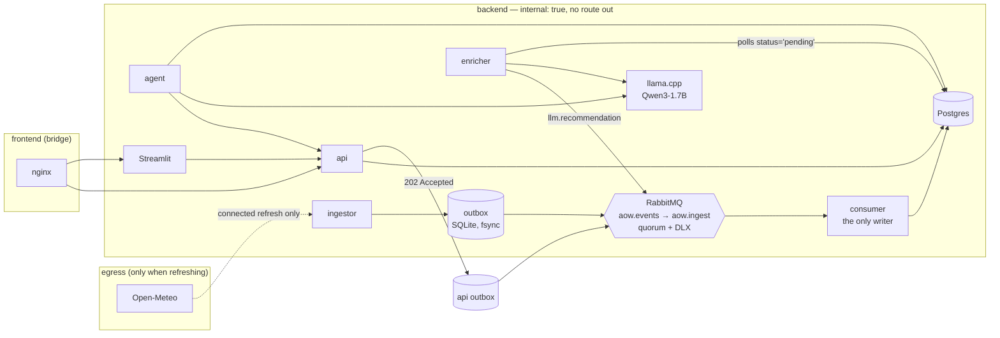

# act-on-weather

Weather for five cities, turned into activity recommendations by a **local**
open-weights model, with every collected record travelling through a queue into
Postgres — and the whole thing running with **no internet at all** once it has
been staged.

Ask it questions:

> **Q:** What is the weather tomorrow in Rome?
> **A:** Tomorrow in Rome, 2026-09-24, will be sunny with temperatures ranging from 15 °C to 27 °C. There is a slight chance of rain, but it's expected to be light and brief. The weather is suitable for sightseeing and outdoor activities.
> *weather as of 2026-09-23 18:16 UTC · forecast covers 2026-09-23 to 2026-10-08 · sources: Open-Meteo*

That footer is not decoration. It is written by code, after the model has
spoken, and it is the mechanism that keeps a stale snapshot from looking like
live data. Ask about a date outside the window and the system says so instead
of guessing — without calling the model at all.

---

## Quick start

**Once, connected** (~2.2 GB of images, ~1.2 GB model, roughly 5–10 minutes):

```sh
cp .env.example .env      # then fill in the passwords
make stage                # pull the pinned images, fetch the model, build
```

**From then on, no internet required:**

```sh
make up                   # or: docker compose up -d
```

| | |
|---|---|
| UI | <http://localhost:8080> |
| API | <http://localhost:8000/docs> |

Two things to expect on first boot:

* **`llm` stays unhealthy for about three minutes** while llama.cpp loads the
  model. `docker compose ps` looks like a failed stack until it does. It isn't.
* **Give Docker Desktop at least 8 GB.** The whole stack's memory limits sum to
  under 6 GB, with the model server the largest single consumer at 3 GB.

The data is already in the repo (`data/snapshot/`), so a fresh `git clone`
works offline immediately. Nothing is downloaded at runtime — not packages, not
model weights, not map tiles, not fonts, not a CDN script.

---

## What it does

| | |
|---|---|
| **Collects** | 16-day daily forecasts for Rome, London, Lisbon, Tel Aviv and Reykjavík; places, background and a small verified event set |
| **Decides** | a deterministic suitability score per (city, day, activity), from rules in `data/activities.yml` |
| **Words** | a local Qwen3-1.7B writes one or two sentences about each score |
| **Answers** | an agent resolves the question in code and answers from stored rows only |
| **Plans** | a day-by-day itinerary assembled from rows that actually exist |
| **Updates** | corrections and refreshes, both travelling through the queue |

### Pages

* **Forecast** — temperature and rainfall per city, with the stored rows behind it.
* **Suitability** — a city × day × activity heatmap, plus a box to ask about
  *any* activity you type, not just the five that have rules.
* **Ask the agent** — chat, with a panel showing exactly which rows the answer used.
* **Trip planner** — build a plan, then save it through the queue.
* **Correct a record** — edit a stored row and watch the revision advance.

---

## Architecture



Eleven containers. `postgres`, `rabbitmq`, `migrate` (one-shot), `llm`,
`ingestor`, `consumer`, `enricher`, `api`, `agent`, `ui`, `edge`.

### The data flow, exactly

1. The **ingestor** reads the committed snapshot (or fetches live, when
   attached to `egress`) and **fsyncs each record into a local SQLite outbox**
   on a named volume. *That write is the acceptance point.*
2. A publisher loop drains the outbox to RabbitMQ under **publisher confirms**
   with `mandatory=True`. A record is marked published only once the broker
   confirms it.
3. The **consumer** — the only role in the system holding write grants —
   validates the payload, then writes the business row **and** the
   `message_id` into `ingest_log` in **one transaction**, and acks only after
   that commits.
4. Storing weather also computes and stores the **rule-based score** for each
   activity, immediately, with `status='pending'` for the wording only.
5. The **enricher** polls pending rows, makes **one** grammar-constrained call
   to the local model, and publishes the result back into the exchange — so
   the recommendation reaches the database through the queue like everything
   else.
6. The **api** and the **agent** read as `aow_reader`, which holds `SELECT` and
   nothing else.

### Networks

| network | who is on it | why |
|---|---|---|
| `backend` | everything | `internal: true` — Docker itself gives it no gateway |
| `frontend` | `edge` only | Docker cannot publish a port from an internal network, so exactly one container straddles the boundary |
| `egress` | nobody, by default | `compose.connected.yml` attaches the ingestor for a refresh |

Only 8080 and 8000 are published. Not the database, not the broker, not the
management UI, not the model server.

---

## Delivery guarantees, and their boundary

**The guarantee.** From the moment a record is fsynced into a producer's outbox
on a named volume, it reaches one of exactly two terminal states:

* **stored** in Postgres, or
* **quarantined** in `aow.dlq`, visible and redrivable.

Consumer, broker and database outages *delay* a record. None of them lose it.

**How.** At-least-once delivery plus idempotent writes, which together give
effectively-once storage. The idempotency key is `message_id`, inserted into
`ingest_log` in the same transaction as the business write. Concretely:

| failure | what happens |
|---|---|
| consumer crashes **before** commit | nothing was written; the broker redelivers |
| consumer crashes **after** commit, **before** ack | the broker redelivers; `ingest_log`'s primary key rejects it; acked without a second write |
| database unreachable | the handler raises, the message is requeued, the consumer waits and reconnects |
| broker unreachable | publishing stops, **accepting does not**; records accumulate on the volume and replay |
| poison message | fails validation before any write, dead-letters to `aow.dlq`, does not block the queue |
| model down or slow | irrelevant to weather: the score is already stored, only the wording waits |

**What is *not* covered**, stated plainly: a destroyed volume, a full disk, and
data that was never accepted in the first place. Weather that was never fetched
can be re-fetched while connected — `make refresh`. There is no absolute
guarantee here and the code does not pretend otherwise.

**Proof, not assertion:**

```sh
make no-data-loss
```

Three drills — consumer down, broker down, poison message. Each one follows a
**single accepted `message_id`** to its terminal state. Row counts are
deliberately not the assertion: a loss and a duplicate cancel out in a count.

---

## Technical choices, and what was rejected

| choice | why | rejected |
|---|---|---|
| **Open-Meteo** | no API key, so the air-gapped bundle has no secret to carry and no account to expire; the free tier includes the 16-day daily forecast that "this week" needs | **OpenWeather** — a key to manage, and its free tier splits the forecast horizon awkwardly |
| **RabbitMQ**, quorum queues | per-message ack after DB commit, a real DLX, and `x-delivery-limit` are exactly the primitives M11 needs, with the smallest operational surface | **Kafka/Redpanda** — offset-based, so per-message quarantine needs machinery; heavier for one node. **Redis Streams** — durability story is weaker and harder to defend |
| **Outbox before the broker** | publisher confirms alone cannot help if the broker is *unreachable*. The outbox is what makes "the broker is down" a delay rather than a loss | **confirms only** — leaves a window where an accepted record exists nowhere durable |
| **Deterministic score, model phrases it** | the verdict is reproducible, testable and defensible; a model outage degrades the wording, never the content | **LLM decides suitability** — unrepeatable, untestable, and it would put a 1.7B model on the critical path |
| **Router-first agent** | city, dates and coverage resolved in readable code; one model call to phrase retrieved rows. E1 answers in ~5 s | **model tool-calling** — 3–4 sequential generations on CPU (30–90 s), non-deterministic in front of a reviewer, and silent when it goes wrong |
| **Qwen3-1.7B Q4_K_M** | runs on CPU at ~1.2 s per call, Apache-2.0, 1.2 GB on disk, reliable under a JSON-schema grammar | a 3–4 B model — better prose, but 3–4× the latency on the reviewer's likely CPU-only machine |
| **Streamlit** | five working pages in the time a hand-written SPA would take to scaffold, and it bundles its own assets, so it works offline | a React SPA — more polish, but the brief weighs the pipeline more heavily |
| **Docker Compose** | one command, identical on Linux, macOS and Windows | Kubernetes — the production path, described below, not the demo path |

**Thinking mode is disabled on the model** (`enable_thinking: false`). Left on,
Qwen3 spends its whole token budget in `reasoning_content` and returns empty
content: measured 4.2 s and no answer, versus 1.2 s and a clean one.

---

## Offline operation, and its limits

```sh
make offline
```

That script proves four things structurally — `aow_backend` really is
`internal`, no service can open an outbound connection, no hosted-model SDK or
endpoint exists anywhere in the source, and the model file is loaded from a
local bind mount — and then answers both of the brief's example questions plus
one deliberately out-of-range question.

**The real proof is behavioural: disable the host's network adapter and run it
again.** Everything above still passes.

**What offline cannot do**, and what happens instead:

| | |
|---|---|
| Fetch new weather | the coverage window stops moving; questions beyond it are **refused**, not guessed |
| Discover new places or events | the system says it has no record, rather than inventing one |
| Correct a stored record | **works offline** — it is a local write through the local queue |
| Re-word recommendations | **works offline** — the model is local |

When the snapshot goes stale, `make refresh` re-fetches the forecast while
connected and the window moves forward. Until then, every answer and every
chart carries the as-of stamp that says how old it is.

---

## Data sources and licences

| data | source | licence | how |
|---|---|---|---|
| Weather | [Open-Meteo](https://open-meteo.com/) | CC BY 4.0 | fetched by `services/ingestor/fetch_content.py`, committed to `data/snapshot/weather.jsonl` |
| Places | **Wikidata** (default) or OpenStreetMap via Overpass | CC0 / ODbL © OpenStreetMap contributors | same script; every row keeps its own source URL |
| Background | Wikipedia REST summaries | CC BY-SA 4.0 | same script; every row keeps its article URL |
| Events | venue listings | see each row's `source_url` | **hand-verified**, in `data/events.seed.jsonl` |

**Why Wikidata and not OpenStreetMap for places.** OSM is the better source and
the code for it is still there (`--places-source osm`). It is not the default
because at staging time all four public Overpass mirrors were either refusing
connections or timing out — reproducibly, over an hour. Wikidata's SPARQL
endpoint answered in seconds. The trade is real and visible in the data:
Wikidata holds *notable* venues, so you get the Royal Academy of Music Museum
and Harrods, not every café on the street. Each row records which source it
came from, and the agent's footer names it, so nothing here is guesswork about
provenance.

**Nothing is invented.** There is no free, licensable, offline-stageable feed of
concerts and fixtures for five cities, and fabricating them was not an option —
so the event set is small, hand-checked against its own sources, and honest
about its size. Rows marked `is_sample` are labelled as samples in the UI and
in the agent's answers. A city with no events on record produces "none on
record", never a plausible-sounding invention.

Re-fetch the whole snapshot with `make snapshot`, review the diff, and commit it.

---

## Updating stored information (M12)

Three paths, two of which work offline:

1. **A correction** — `PATCH /records/{entity}/{id}` → 202 + a `message_id` →
   queue → consumer → `revision + 1` and a `record_history` row. Works offline.
   `make update` demonstrates it end to end.
2. **A connected refresh** — `make refresh` re-fetches the forecast and moves
   the coverage window forward. Needs connectivity, by definition.
3. **Re-enrichment** — when the weather behind a recommendation changes, the
   consumer resets that row to `pending` and the enricher rewords it. Works
   offline. `make reenrich` demonstrates it, including a full model outage.

A user edit is accepted, not applied: `202`, never `200`. The UI says so too.
There is exactly one write path into this database.

---

## Security

* Every image is pinned **by digest** (`IMAGES.lock`, enforced in CI).
* The model is verified against `models.lock` before it is used.
* Containers run as **uid 10001** wherever the base image allows.
* **Three database roles**: the owner runs migrations; `aow_writer` (consumer
  only) may `INSERT`/`UPDATE` and *not* `DELETE`; `aow_reader` (api, agent,
  enricher) may only `SELECT`. Enforced by grants, not convention.
* Secrets live only in a gitignored `.env`; `.env.example` is committed.
* Only 8080 and 8000 are published.
* CI runs **Trivy** (`HIGH,CRITICAL`) on both images and the filesystem,
  **gitleaks**, and a guard that fails the build if a hosted-model SDK or
  endpoint ever appears in the source.

---

## Tests and CI

```sh
make test     # unit tests, in a container, with --network none
```

Forty tests covering the rule engine's truth table (including that indoor
activities really are scored as the inverse of outdoor ones), envelope
round-tripping and rejection of malformed messages, payload validation, and the
outbox's two load-bearing properties: accepting the same message twice is a
no-op, and an accepted-but-unpublished record survives the process dying.

CI (`.github/workflows/ci.yml`) runs lint → unit → guard → build → Trivy. CI
has the internet; the runtime does not. That asymmetry is deliberate, and the
guard job is what keeps it honest.

---

## Requirements traceability

IDs are from `ASSIGNMENT.md`, which decomposes the brief. "Verify" is a command
you can run.

| ID | Requirement | Where it lives | Verify |
|---|---|---|---|
| M1 | Weather for five cities from an external API | `services/ingestor/providers.py` (Open-Meteo), `data/cities.yml` | `curl localhost:8000/coverage` → 80 rows, 5 cities |
| M2 | LLM recommendation: is the weather suitable for the activity | `common/rules.py` scores it, `services/enricher/` words it; free-text via `POST /recommendations` | `make reenrich`; the Suitability page |
| M3 | Local open-weights LLM, no external API | `llm` (llama.cpp + Qwen3-1.7B), `common/llm.py` is the only client | `make offline` §3 |
| M4 | All collected data → queue → database | outbox → `aow.events` → consumer; consumer is the only writer | `make no-data-loss`; `psql` grants |
| M5 | Containerized, one uniform way to run | `compose.yml`, `Makefile` | `docker compose up -d` |
| M6 | Runs on-prem without full internet | `backend` is `internal: true`; committed snapshot | `make offline`, ideally with the host NIC down |
| M7 | Agent answering varied questions from stored data | `services/agent/` | `make questions` |
| M8 | Tourism: history, places, sports events | `facts`, `places`, `events` tables | `make questions` (Lisbon history, London sports) |
| M9 | Itinerary for chosen destinations | `POST /agent/itinerary`, the Trip planner page | build and save a plan in the UI |
| M10 | Good data visualization | forecast chart, city×day×activity heatmap, coverage banner | the Forecast and Suitability pages |
| M11 | Temporary failures without data loss | outbox, confirms, ack-after-commit, DLQ + redrive | `make no-data-loss` |
| M12 | Update stored information | `PATCH /records/...`, `make refresh`, re-enrichment | `make update` |
| S1 | Repo with code, config, CI/CD, README | this repo, `.github/workflows/ci.yml` | `gh run list` |
| S2 | README: startup, architecture, choices and reasoning | this file | you are reading it |
| B1 | Full tests for all components | **partial** — 57 unit tests; the demo scripts are the integration evidence, not a test container | `make test` |
| B2 | LLM observability metrics | **not attempted** — `llm` exposes llama.cpp's own `--metrics`, unscraped | — |
| B3 | Automatic recovery from failures | **partial, and not as a bonus feature** — reconnect-with-backoff everywhere, `restart: unless-stopped`, healthchecks, automatic re-enrichment | `make reenrich`, `make no-data-loss` |

---

## Reproducing every claim in this file

```sh
make test           # unit tests, no network
make offline        # M6  — air-gapped operation, and the no-guessing rule
make questions      # M7/M8 — agent breadth, including what it refuses
make no-data-loss   # M11 — three drills, each tracing one accepted message_id
make update         # M12 — an edit through the queue, with its history
make reenrich       # the model is a presentation layer, not a dependency
```

Or `make demo` for all of them, in order.

---

## Known limitations

Stated, not implied:

* **Single-replica broker and database.** Fine for this; not an HA design.
* **The guarantee is demonstrated by three drills, not by per-message
  accounting.** There is no reconciler proving every enrichment was delivered.
* **Drill 2 (database down) was cut for time.** The reconnect path it would
  exercise is in `services/common/db.py` and is used by every service.
* **The enricher polls** rather than binding to the weather stream. That is a
  deliberate trade: no second delivery branch means no silent partial fan-out.
* **A user-entered activity is scored against general outdoor comfort**, not a
  rule tuned for it, and the answer says so. It is not a new data fetch.
* **No marine data**, so no surfing among the scored defaults. Typed as a
  free-text activity it is answered from the weather on hand, with that caveat.
* **The verified event set is small and London-weighted.** Other cities
  correctly report no events on record.
* **The agent routes deterministically in code** and uses the model only to
  phrase retrieved rows. It is not a general-purpose assistant, and that is the
  point.
* **Writes are eventually consistent** — 202, then the queue.
* **`edge` is the one container on a routable network**, by necessity.
* **The CSP carries `'unsafe-inline'` and `'unsafe-eval'`** because Streamlit's
  bundle requires them. Noted rather than quietly included.
* **The bonus items (B1–B3) are not attempted**: no Prometheus/Grafana stack,
  no integration-test container. `llm` exposes llama.cpp's own `--metrics`.

---

## Production path (Kubernetes / OpenShift)

This runs on Compose because that is the right shape for a reviewable
take-home. What would change:

* **Postgres** via an operator (CloudNativePG) with a PVC, backups and a
  replica; **RabbitMQ** via the cluster operator with a quorum of three.
* **Outbox volumes** become PVCs with `ReadWriteOnce`; the ingestor and API
  become StatefulSets, because an outbox is state.
* **A default-deny egress `NetworkPolicy`** replaces `internal: true`, with a
  single explicit allow for the ingestor when a refresh is scheduled.
* **Air-gapped install** mirrors the pinned digests into an internal registry
  (Harbor), and the model goes into a PVC or an OCI artifact rather than a bind
  mount.
* **Secrets** move to Vault or sealed secrets; the three database roles stay as
  they are, because that separation is the useful part.
* `migrate` becomes a Job with a Helm `pre-install`/`pre-upgrade` hook;
  healthchecks become readiness and liveness probes, with the model load
  covered by a `startupProbe`.
* Prometheus scrapes the services (B2, not attempted here), and Loki takes the
  logs.

---

## Where the assignment's requirements live

`ASSIGNMENT.md` holds the brief, our decomposition into requirement IDs, and —
in its own section — the design choices that are **ours** rather than the
brief's. This README does not restate them; where it says "our choice", that is
where the reasoning is recorded.
