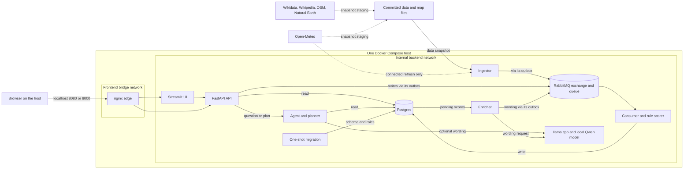
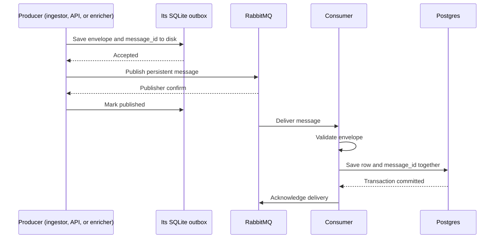

# Architecture: act-on-weather

This guide is for someone seeing the project for the first time. The diagrams are
Mermaid inside Markdown, so GitHub renders them directly and the source stays
reviewable in Git. The [README](../README.md) has the commands to run the app;
this page explains what those commands start and how data moves.

## The idea in one minute

The app turns stored weather for Rome, London, Lisbon, Tel Aviv, and Reykjavík
into activity scores, short explanations, answers to travel questions, and
day-by-day plans. It also shows stored places, background facts, and events.

The **score is calculated by code** from weather and the rules in
[`data/activities.yml`](../data/activities.yml). A local language model writes
some explanations and phrases open-ended answers. It does not set the score.
The app shows the date and source of stored data and refuses weather dates
outside its saved forecast window.

Three terms used below:

| Term | Plain meaning here |
|---|---|
| **Snapshot** | Data files committed in [`data/snapshot/`](../data/snapshot/) so the app can start without fetching anything. |
| **Outbox** | A small SQLite file on a persistent Docker volume where a producer saves a message before trying the queue. |
| **Queue** | RabbitMQ holds messages until the consumer can store them in Postgres. A message can be delivered again, so each has a unique `message_id`. |

## System map

Solid arrows are normal local paths. The dotted arrow is the operator-enabled
internet path; it is absent from the default run. “Read” and “write” on the
arrows describe what a service does, not a second public port.

The diagram groups the three outboxes into their producer arrows to keep the
system map readable. Each is a **separate SQLite file and named volume**:
`ingestor_outbox`, `api_outbox`, and `enricher_outbox` in
[`compose.yml`](../compose.yml). The consumer is the only running service with
Postgres application write credentials. It also seeds the configured cities
directly at startup and deletes generated demo events when demo mode is turned
off; those two operations are explicit exceptions to the queue path for
collected records. Hand-verified event listings are staged into the committed
snapshot; generated event samples are loaded only with the demo overlay.

### What lives where

| Data | Input | Stored result |
|---|---|---|
| City names, locations, time zones | [`cities.yml`](../data/cities.yml) | `cities`, seeded by the consumer |
| Forecast and activity verdicts | Open-Meteo snapshot or connected refresh, plus [`activities.yml`](../data/activities.yml) rules | `weather_daily` and `recommendations` |
| Places, background facts, events | Committed JSONL snapshot; optional labelled demo events | `places`, `facts`, `events` |
| Model-written recommendation text | Pending score row and local model | `recommendations.text` and status, returned through the queue |
| Saved trip plan | User request after the agent builds a plan | `itineraries` |
| Delivery IDs and edit history | Consumer transaction and revision triggers | `ingest_log`, `record_history` |
| Map backdrop | Bundled compressed GeoJSON in [`data/map/`](../data/map/) | Read by the UI from disk; no database or tile server |
| Report of the last operator refresh | [`scripts/refresh.sh`](../scripts/refresh.sh) on its way out | One JSON file on the `refresh_state` volume — writable in the ingestor, read-only in the api, served at `GET /refresh/last`. Deliberately not a row: a refresh the provider refused accepts no messages, so the queue has nothing to carry. See [`refresh_state.py`](../services/common/refresh_state.py) |

## Follow one record: the data flow

The same delivery path handles forecast rows, places, facts, events, user
corrections, saved itineraries, itinerary removals, and generated wording. The producer differs;
the durable handoff does not.

The **Wipe all user data** control follows that same queue. The consumer reads
the ingestor's outbox volume without modifying it, verifies that every
committed source envelope is present, then rebuilds collected rows and rule
scores in one transaction. This removes user-created rows and reverts manual
corrections while keeping connected source updates. A missing source envelope
aborts the wipe before it deletes anything.
The API clears its prior user-write outbox payloads after commit; the enricher
discards model output accepted before the wipe and skips results from a model
call that crossed the wipe boundary.

**“Accepted” means saved in the producer's outbox, not yet stored in
Postgres.** That is why write endpoints return `202 Accepted` with a
`message_id`. [`GET /outbox/{message_id}`](../services/api/main.py) lets a
caller follow an API write. A broker outage leaves the outbox row waiting; a
database outage makes RabbitMQ retry delivery. A malformed message, or one
that exhausts its delivery limit, goes to the dead-letter queue (`aow.dlq`)
for inspection and manual redrive. If delivery
repeats after a commit, [`ingest_log`](../db/migrations/001_init.sql) prevents a
second business write with the same ID. This is **at-least-once delivery with
idempotent storage**, not a claim that a message is delivered only once.
RabbitMQ may deliver a message before its producer has marked the outbox row
published; the `message_id` also makes that race safe to retry.

Weather adds one step inside the consumer's database transaction: the rule
engine stores a score and a verdict band for each supported activity. Only the
top `ENRICH_TOP_N` scores for a city and day start as `pending` for model prose;
the rest are `deferred` but remain scored, visible, and answerable. The
[`enricher`](../services/enricher/main.py) reads pending rows, asks the local
model for a sentence, then sends that result through **its own outbox and the
same queue**. A slow or unavailable model therefore does not stop the weather
row or score from being stored. A connected forecast refresh rescoring a day
invalidates wording for that day.

For recovery, [`services/common/reconcile.py`](../services/common/reconcile.py)
compares confirmed outbox IDs with committed `ingest_log` IDs before selected
replay; the README states the guarantee it supports under
[the delivery guarantee, and its boundary](../README.md#the-delivery-guarantee-and-its-boundary).
This matters because a publisher confirm proves RabbitMQ accepted a message; it
does not prove the business row reached Postgres. Persistent volumes must be
kept until their messages have been accounted for.

## Follow a person: the user flow

1. **Browse:** The browser reaches nginx on the host's `localhost:8080`.
   Streamlit calls the API over the internal Docker network. The API reads
   Postgres and returns stored forecast, scores, places, events, facts, and
   coverage. The map backdrop is bundled GeoJSON read by the UI, so it needs
   no browser map-tile request.
2. **Ask:** The UI sends a question to the API, which forwards it to the agent.
   The agent resolves the city, dates, and question type in code, checks
   forecast coverage, and reads matching Postgres rows. A named activity
   answer is rendered directly from stored daily scores. For other questions,
   the local model may phrase the retrieved rows once; code adds the data
   freshness footer. If the model fails, code renders a plainer answer.
3. **Plan:** The agent builds a day-by-day plan from stored scores, places, and
   events. Interests and repeat penalties change suggestion order, not stored
   scores. The plan is returned first. If the user saves it, the API accepts a
   new queued write and the consumer stores it later.
4. **Correct or reword:** A correction or re-enrichment request also returns
   `202` and follows the data flow above. A correction creates a new revision
   and a history row. Re-enrichment changes wording, not the score.

The nine UI pages, in navigation order, are Dashboard, Forecast, Suitability,
Trip planner, Places map, Ask the agent, Update data, Data coverage and
Monitoring -- the set registered in `PAGES` in
[`services/ui/app.py`](../services/ui/app.py). See
[the README](../README.md#using-it) for what each one shows.

## Follow a deployment: the infrastructure flow

| Stage | What happens | Where to check |
|---|---|---|
| **Stage once, while connected** | Pull digest-pinned base images, download and checksum the model, build the service and UI images. The source snapshot and map files are already in Git. | [Setup](../README.md#setup), [`models.lock`](../models.lock), [`IMAGES.lock`](../IMAGES.lock) |
| **Start offline** | `docker compose up -d` starts Postgres and RabbitMQ; one-shot `migrate` installs the schema and roles. Services start, and the ingestor replays the committed snapshot through its outbox. | [`compose.yml`](../compose.yml), [`db/migrations/`](../db/migrations/) |
| **Serve locally** | nginx alone joins the routable `frontend` and isolated `backend` networks. Host ports 8080 and 8000 bind to `127.0.0.1` by default. Postgres, RabbitMQ, and the model have no published ports. | [`edge/nginx.conf`](../edge/nginx.conf), [`compose.yml`](../compose.yml) |
| **Refresh when connected** | The operator temporarily attaches only the ingestor to `egress`, runs the forecast refresh, then returns it to the default network. Newly accepted weather follows the normal outbox and queue path. | [`compose.connected.yml`](../compose.connected.yml), [connected refresh](../README.md#connected-refresh) |
| **Prove and release** | GitHub Actions lint, test, check secrets and pinned images, scan vulnerabilities, run a Compose integration test, and publish tested service/UI images by commit SHA on main. An offline bundle can be packaged separately. | [CI workflow](../.github/workflows/ci.yml), [RELEASE.md](RELEASE.md), [installing a packaged release](../README.md#installing-a-packaged-release) |

The default `backend` network is Docker `internal: true`; services attached
only to it have no internet route. The `frontend` network lets nginx publish
the two local ports. nginx is the only container on that network. The `egress`
network exists for connected maintenance and has no member in a normal run.
Docker Compose runs this on one host; named volumes hold Postgres data,
RabbitMQ data, and the three outboxes.

## Technology choices

These are the parts that materially affect the design. Library versions and
image digests live in the linked files so this explanation does not go stale
when a dependency is updated.

| Tool or technology | Job and reason chosen | Main cost or boundary |
|---|---|---|
| [Docker Compose](../compose.yml) | Starts the whole local stack the same way on Windows, macOS, and Linux; network and volume boundaries are visible in one file. | One host, no built-in high availability. |
| [Python 3.12](../services/Dockerfile), [FastAPI and Uvicorn](../services/requirements.txt) | Shared service image and small HTTP API/agent services with generated API docs. | HTTP calls are local and synchronous; model replies can take time. |
| [Pydantic](../services/common/schemas.py) and [PyYAML](../services/common/requirements.txt) | Validate queue/API payloads and load the human-editable city, activity, and interest rules. | Rule changes require a rebuild and clear versioning of scores. |
| [Open-Meteo](../services/ingestor/providers.py) | Key-free 16-day forecast that can be fetched during staging or a connected refresh. | No new forecast is available when offline. |
| [Wikidata, Wikipedia, OpenStreetMap, and Natural Earth](../README.md#data-sources-and-licences) | Provide sourced places, background text, and a small offline map. | Place coverage is selective; a place is not proof of an open venue or a scheduled event. |
| [SQLite outboxes](../services/common/outbox.py) | Save accepted messages on producer volumes even when RabbitMQ or Postgres is unavailable. | Volumes need disk space, protection, and recovery checks. |
| [RabbitMQ quorum queue](../services/common/rabbit.py) and [Pika](../services/common/requirements.txt) | Durable handoff with publisher confirms, manual acknowledgement, retries, and a dead-letter queue. | A single broker node is durable but not highly available. |
| [Postgres](../db/migrations/001_init.sql) and [psycopg](../services/common/db.py) | Queryable source of truth; transactions join each business write to its ID; reader and writer grants limit access. | A single database and volume still need backup and restore. |
| [Deterministic rules](../services/common/rules.py) | Give reproducible activity scores and plain reasons; the score does not wait for AI. | Suitability is a heuristic, not a safety or availability guarantee. |
| [llama.cpp and Qwen3-1.7B](../compose.yml) | Run an open-weights model locally on CPU for wording and open-ended answers. | Small-model prose can be slow or unsupported by the rows; the app must show source data. |
| [Streamlit, Plotly, and Pandas](../services/ui/requirements.txt) | Build the interactive UI, charts, heatmap, and local map quickly with bundled browser assets. | UI is designed as a local demo, not a multi-user web product. |
| [nginx](../edge/nginx.conf) | One local entry point routes browser/API traffic into the isolated backend and supports Streamlit's WebSocket. | It is a proxy, not an authentication layer. |
| [GitHub Actions, Ruff, pytest, Trivy, and gitleaks](../.github/workflows/ci.yml) | Make formatting, behavior, dependency security, and image provenance reviewable before publishing images. | CI does not prove a physical air-gapped install, full UI behavior, or backup restore. |

For decisions that changed during the build, including Wikidata over Overpass
and code routing over model tool calls, see
[`TECHNICAL_DECISIONS.md`](../TECHNICAL_DECISIONS.md).
`Pillow` is pinned in the UI image but is not imported by current UI code, so
it has no separate architectural role.

## Limits to state plainly

- **Freshness:** The committed forecast is a dated snapshot. Offline use does
  not move the window forward. A question outside stored weather coverage is
  refused; refresh needs an operator and temporary internet access.
- **Coverage:** The app supports five configured cities and an 18-activity
  catalogue. Default event data is 55 hand-verified listings across all five
  cities, unevenly spread (london 10, rome 10, tel-aviv 8, reykjavik 13,
  lisbon 14); the 45 generated events are opt-in demo samples and are labelled
  as such. Cities and date ranges outside that set honestly show no event on
  record.
- **Event freshness:** A stored event is a reading of a listing page taken on a
  particular day, not an observation. Each row carries `checked_at` and a
  `valid_until` derived from it, and stops being returned as a currently
  scheduled event once that expires — it is still stored and still counted, so
  the coverage panel can distinguish a feed that went stale from a city nobody
  checked. Re-checking a row is a patch through the queue like any other
  correction.
- **Meaning of a score:** A weather score is an estimate from rules. It does
  not establish that a beach is safe to swim at, a venue is open, or an event
  still has tickets. Plans only name places and events present in stored rows.
- **Sea state:** Nothing in this system measures waves, swell or water
  temperature. Surfing, swimming, fishing and a boat ride are therefore capped
  one point below the `good` band, and every answer carrying one of those
  scores names the city's forecast point and its distance from the coast
  reference in `data/cities.yml`.
- **Event dates:** Derived in SQL from the city's own IANA zone, so an event
  starting at local midnight lands on its local day rather than the UTC one,
  and a multi-day run matches every day it is active on.
- **AI answers:** Named activity verdicts come directly from rows. Open-ended
  replies are prompted with retrieved data, but the wording is not checked
  claim by claim; inspect the rows and source links for important claims.
- **Availability and data protection:** There is one Compose host, broker, and
  database. The outbox and queue address temporary outages, not a destroyed
  volume, full disk, or a source fetch that never succeeded. Use reconciliation
  after an incident and establish backups before treating this as production.
- **Access control:** The API has write routes and no application
  authentication. Both published ports bind to loopback by default. A shared
  deployment needs authentication, authorization, and rate limits before
  widening that binding. See [Security](../README.md#security).

## Show the design working

With the stack running, these [demo drills](../demos/) give a reviewer a
specific observation for each important claim:

| Claim | Command | What to observe |
|---|---|---|
| The staged app answers from local data | `docker compose -f compose.tools.yml run --rm demos offline` | Local model answers stored-data questions and refuses a date outside coverage. |
| Accepted messages survive temporary outages | `docker compose -f compose.tools.yml run --rm demos no-data-loss` | The same `message_id` reaches a stored row or the dead-letter queue after broker, consumer, or database failure. |
| An edit follows the queue | `docker compose -f compose.tools.yml run --rm demos update` | A `202` response precedes a revised row and history entry. |
| The agent states its coverage | `docker compose -f compose.tools.yml run --rm demos questions` | Answers include source freshness; unsupported dates and missing rows are identified. |

For a physical offline proof, disable the host's network connection and run
the `offline` drill again. The script's network checks alone do not prove that
the host was disconnected.

## Where to verify or update this map

The diagram describes [`compose.yml`](../compose.yml) plus the optional
[`compose.connected.yml`](../compose.connected.yml) and
[`compose.demo.yml`](../compose.demo.yml) overlays. If a service, published
port, queue path, or write permission changes, update this page in the same
change. The executable checks are the [unit and integration tests](../tests/),
[demo drills](../demos/), and [CI workflow](../.github/workflows/ci.yml).
